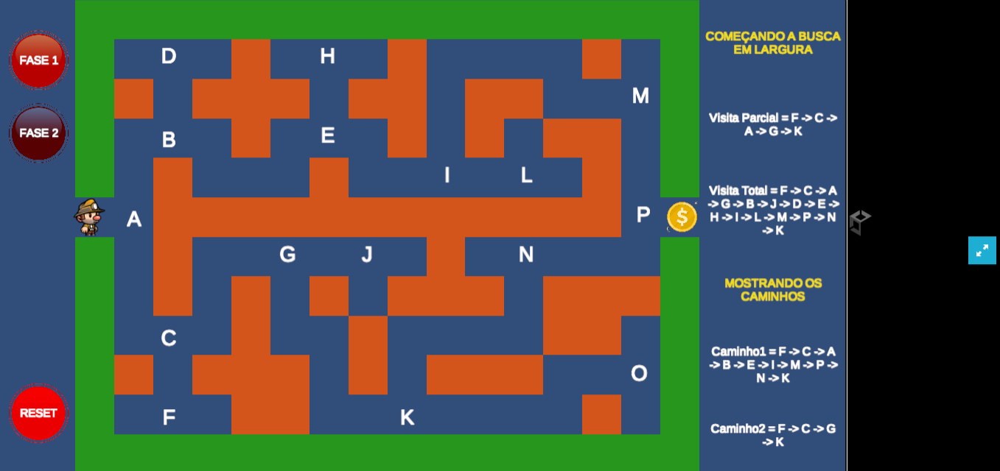

# BFS Algorithm Visualizer (Unity)

Este projeto é uma visualização interativa do algoritmo de busca em largura (Breadth-First Search - BFS), desenvolvido utilizando Unity e C#.

O objetivo é demonstrar de forma visual como o algoritmo percorre um grafo ou grid, explorando nós por níveis até encontrar o destino.

## Preview



## Demonstração

Acesse a versão online:
[https://phel-lip.github.io/Projeto-BFSIA/](https://phel-lip.github.io/BFS-Algorithm-Visualizer-Unity/)

## Sobre o Projeto

O Breadth-First Search (BFS) é um algoritmo clássico de busca utilizado em grafos e estruturas de dados.

Neste projeto, o algoritmo é aplicado em um ambiente visual onde é possível acompanhar:

- A ordem de exploração dos nós
- A propagação da busca em camadas
- O caminho encontrado até o objetivo

## Funcionalidades

- Visualização passo a passo do algoritmo BFS
- Representação visual de nós visitados
- Destaque do caminho final encontrado
- Interface simples e interativa

## Tecnologias Utilizadas

- Unity
- C#
- WebGL (build para navegador)

## Estrutura do Projeto

- Scripts responsáveis pela lógica do BFS
- Sistema de grid para representação dos nós
- Componentes visuais para feedback do algoritmo

## Como Executar Localmente

```bash
1. Clone o repositório: git clone https://github.com/Phel-lip/Projeto-BFSIA.git
2. Abra o projeto no Unity Hub
3. Execute a cena principal no editor
```

## Objetivo

Este projeto foi desenvolvido com foco educacional, visando reforçar conceitos de algoritmos e estruturas de dados através de visualização prática.

## Autor

Thasso Felipe  
https://github.com/Phel-lip
