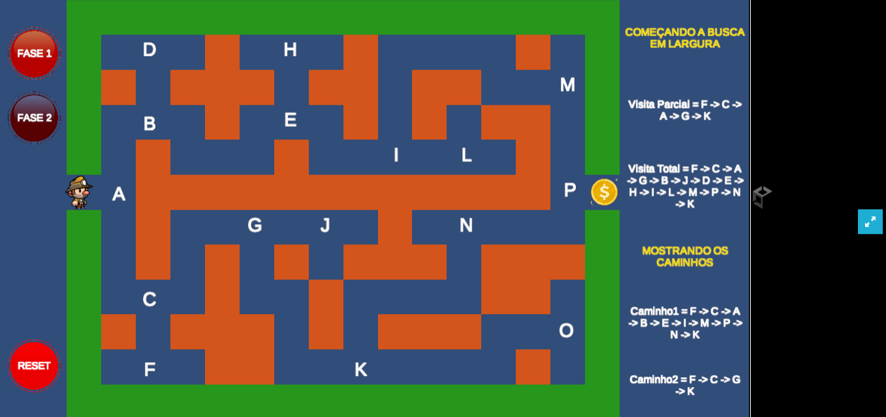

# BFS Algorithm Visualizer (Unity)

Projeto desenvolvido em equipe utilizando Unity e C# para visualizar, de forma interativa, o funcionamento do algoritmo Breadth-First Search (BFS).

Além de reforçar conceitos de algoritmos e estruturas de dados, este projeto marcou uma etapa importante da minha formação em Jogos Digitais e contribuiu para o desenvolvimento do meu raciocínio lógico, base que posteriormente apliquei no desenvolvimento Front-End.

## Preview



## Demonstração

Acesse a versão online:

https://phel-lip.github.io/BFS-Algorithm-Visualizer-Unity/

## Sobre o Projeto

O projeto demonstra visualmente como o algoritmo Breadth-First Search percorre um grafo ou grid, explorando os nós em camadas até encontrar um caminho válido.

O principal objetivo foi transformar um conceito clássico de algoritmos em uma representação visual que facilitasse sua compreensão durante a graduação.

## Funcionalidades

- Visualização da execução do algoritmo BFS
- Representação gráfica dos nós visitados
- Destaque do caminho encontrado
- Interface interativa executada em WebGL

## Tecnologias Utilizadas

- Unity
- C#
- WebGL (build para navegador)

## Estrutura do Projeto

- Implementação da lógica do algoritmo BFS
- Sistema de grid para representação dos nós
- Componentes responsáveis pela visualização da busca
- Exportação da aplicação para WebGL

## Como Executar Localmente

```bash
1. Clone o repositório:
git clone https://github.com/Phel-lip/BFS-Algorithm-Visualizer-Unity.git

2. Abra o projeto no Unity Hub

3. Execute a cena principal no editor
```

## Objetivo

Este projeto foi desenvolvido com foco educacional para representar visualmente o funcionamento do algoritmo Breadth-First Search (BFS).

Além do aprendizado sobre algoritmos e estruturas de dados, a experiência em desenvolvimento colaborativo reforçou habilidades de organização, comunicação e trabalho em equipe durante a construção da aplicação.

## Autor

Thasso Holanda

GitHub:
https://github.com/Phel-lip
